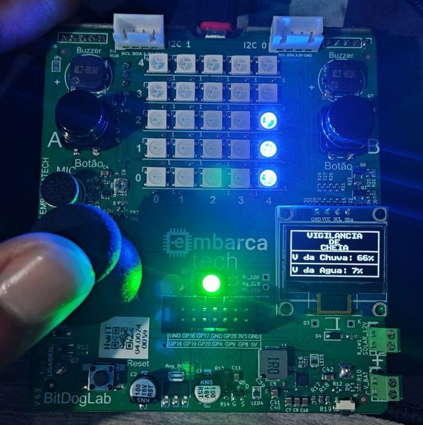
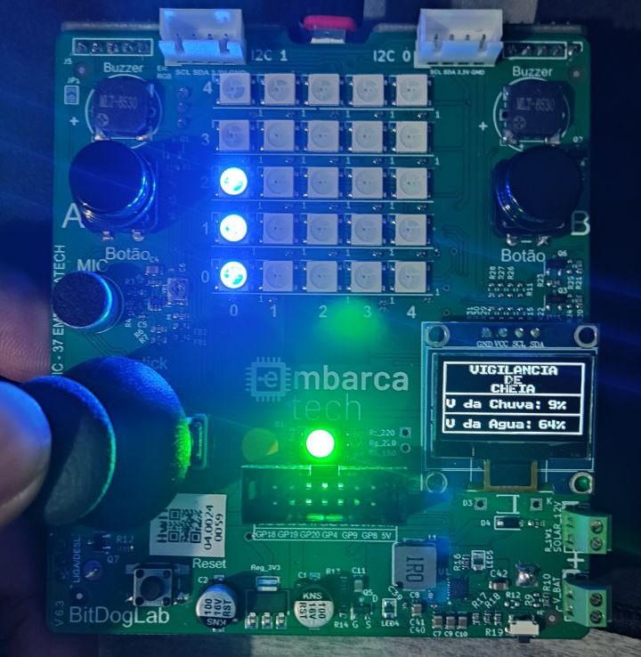
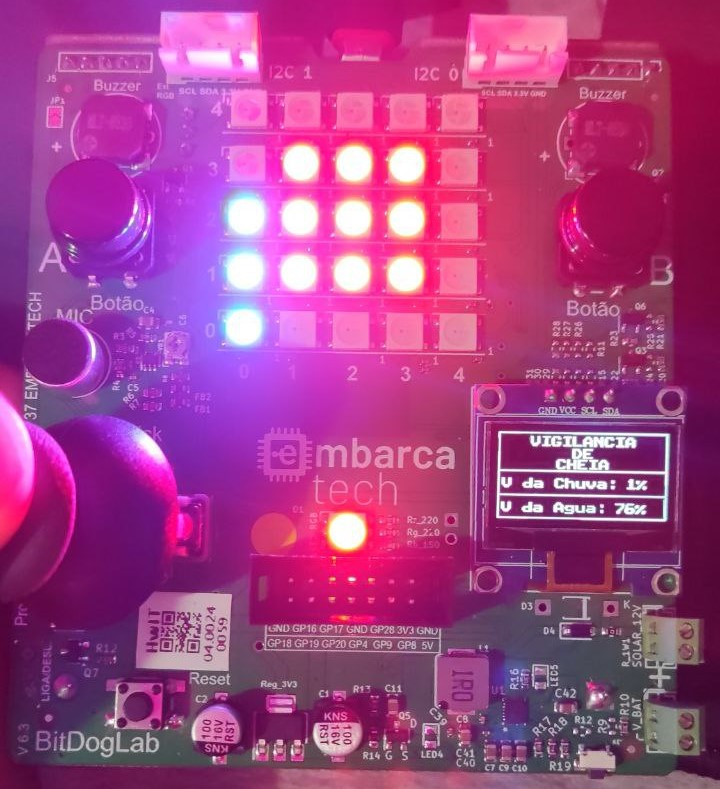

# 🌧️ Estação de Alerta de Enchente com BitDogLab

Este projeto simula um sistema de monitoramento de enchentes utilizando a placa BitDogLab com o sistema operacional FreeRTOS. O sistema realiza a leitura de sensores simulados por joystick e aciona atuadores (LEDs, buzzer, display e matriz de LEDs) para sinalizar níveis críticos de água e chuva. Toda a lógica é baseada em tarefas concorrentes com comunicação via fila.

---

## 🎯 Objetivo

Desenvolver um sistema embarcado que:

- Simula sensores de nível de água e volume de chuva.
- Utiliza FreeRTOS para gerenciar múltiplos periféricos em tarefas independentes.
- Sinaliza níveis críticos por meio de alerta sonoro e visual.
- Atualiza os dados dos sensores em tempo real para todos os atuadores.

---

## ⚙️ Como Funciona

O projeto opera com duas entradas simuladas:

### 🌊 Simulação de Sensores

- **Joystick (eixos X e Y):**
  - Eixo X representa o **nível de água**.
  - Eixo Y representa o **volume de chuva**.
- Os valores analógicos (0 a 4095) são convertidos para percentuais de 0% a 100%.
- Os dados são encapsulados em uma `struct JoystickData` e enviados a uma fila (`xJoystickQueue`).

### 🔄 Tarefas com FreeRTOS

O sistema é dividido em cinco tarefas principais:

1. `vJoystickTask`: Leitura e envio dos dados dos sensores.
2. `vLedsRGBTask`: Sinalização com LED RGB.
3. `vDisplayTask`: Exibição dos valores no display OLED.
4. `vBuzzerTask`: Ativação do alarme sonoro.
5. `vMatrizTask`: Visualização gráfica dos níveis na matriz de LEDs.

Todas as tarefas (exceto a do joystick) consomem os dados da fila e reagem aos valores em tempo real.

---

## 💡 Atuadores e Lógica de Resposta

### 🟢🔴 LED RGB

- **Verde:** Sistema normal.
- **Vermelho:** Volume de chuva ≥ 80% ou nível da água ≥ 70%.

### 📺 Display OLED

- Exibe os valores atuais em formato percentual

### 🧱 Matriz de LEDs (5x5)

- **Coluna 1:** Representa o nível de água.
- **Coluna 5:** Representa o volume de chuva.
- Os LEDs acendem de baixo para cima a cada 20%.
- Quando os valores ultrapassam os limites críticos, uma área central da matriz pisca em vermelho como reforço de alerta.

### 🔊 Buzzer

- **Desligado:** Níveis seguros.
- **Ligado:** Quando qualquer valor atinge nível crítico.
- Emite sons intermitentes simulando um alarme de emergência.

---

## 🧠 Comunicação via Fila

- O sistema utiliza **uma única fila** (`xJoystickQueue`) para transmitir os dados da simulação dos sensores.

---

## 🧩 Estrutura do Código

### Funções principais

- `vJoystickTask()`: Leitura e envio dos dados para a fila.
- `vLedsRGBTask()`: Lógica de ativação dos LEDs com base nos limites.
- `vDisplayTask()`: Atualização do display OLED.
- `vBuzzerTask()`: Controle do alarme sonoro.
- `vMatrizTask()`: Representação gráfica dos dados na matriz de LEDs.

---

## 🛠️ Como Executar o Projeto

1. **Configure o ambiente:**

   - SDK do Raspberry Pi Pico corretamente instalado.
   - CMake configurado corretamente.

2. **Clone o repositório**

   ```
   git clone https://github.com/jacks0nsilva/ATIVIDADE-06.git
   ```

3. **Abra o projeto no VS Code com a extensão do Raspberry Pi Pico**

4. **Altere o caminho do Kernel do FreeRTOS:**

- No arquivo `CMakeLists.txt`, localize a linha que define o caminho do FreeRTOS e ajuste conforme necessário. Por exemplo:

  ```cmake
  set(FREERTOS_KERNEL_PATH "/caminho/para/o/seu/FreeRTOS")
  ```

5. **Execute os passos:**
   - **Clean CMake**: Limpeza do build anterior.
   - **Configure Project**: Para detectar os arquivos e preparar a compilação.
   - **Compile Project**: Gerar o arquivo `.uf2`.
   - **Run Project [USB]**: Instala o firmware diretamente na placa.

---

## 📷 Demonstração



### Funcionamento padrão do sistema. A luz verde indica que a operação está ativa e o display exibe os dados captados pelos sensores (joystick) em tempo real.

---



### Nesse caso, três dos cinco LEDs da primeira coluna são acesos em azul representando que o nível de água está entre 60% e 79%.

---



### Nesse momento o nível da água ultrapassa o limite estabelecido de 70%, a cor do LED RGB é alterada para vermelho a fim de indicar um status de perigo eminente, a matriz de LEDs segue o mesmo propósito: acende um quadrado vermelho que pisca de maneira intermitente.
